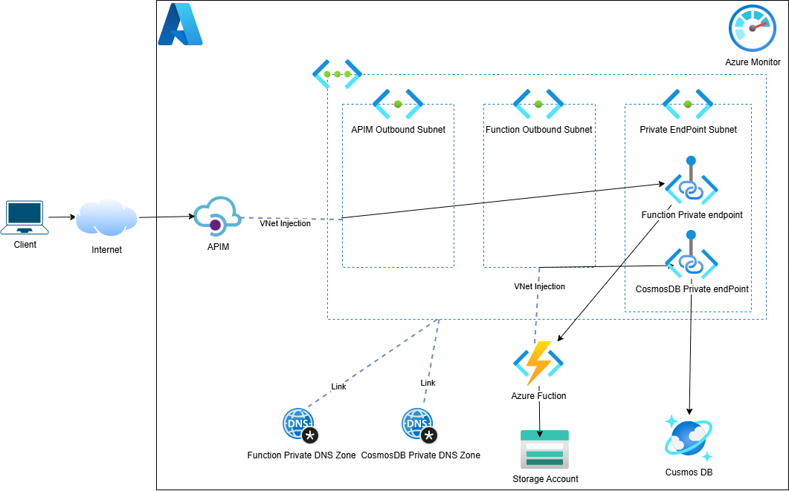
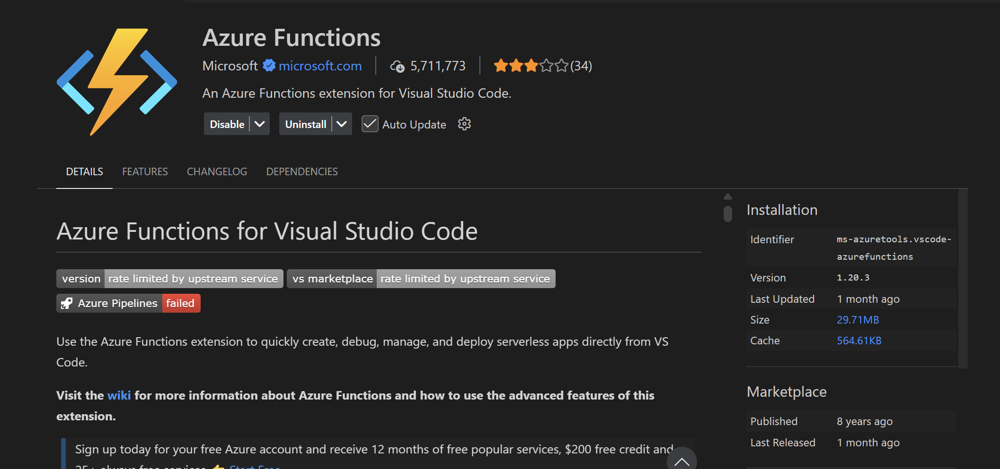
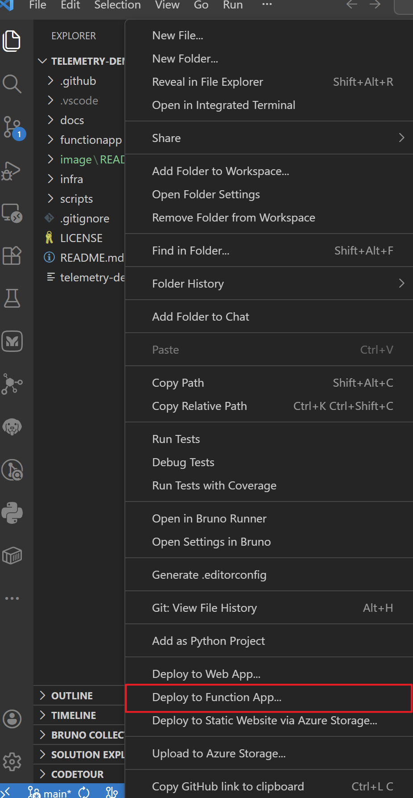
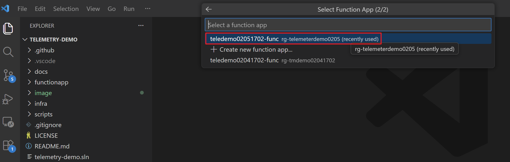
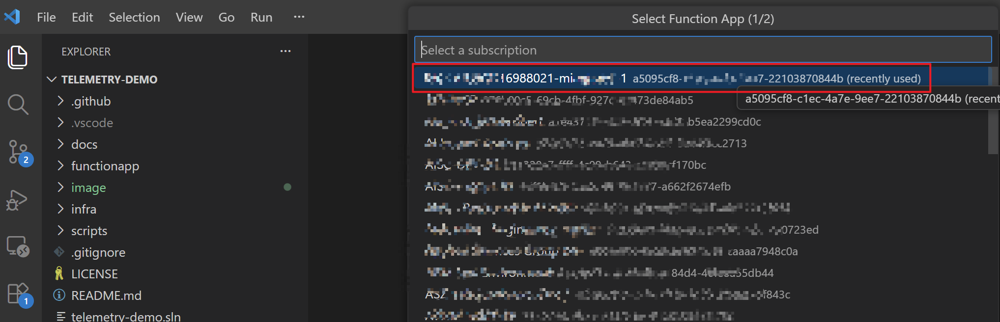
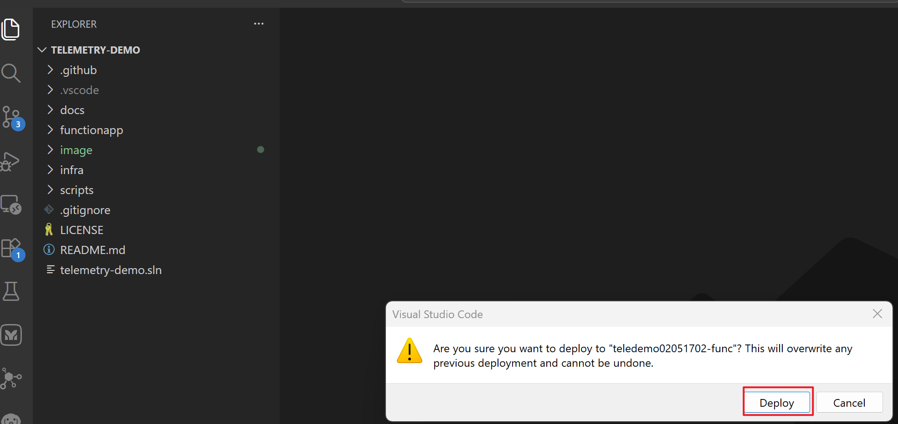
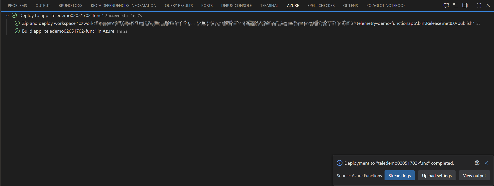

# テレメトリ取り込みデモ (APIM Standard V2 → Functions Flex → Cosmos DB)

## 概要

このデモは、本番レベルのテレメトリ取り込みパイプラインをプロビジョニングします：



- **API Management** (Standard V2 層、アウトバウンドVENT統合)
- **Function App** (Flex Consumption、.NET 8 isolated)
- **Cosmos DB** (NoSQL)、コンテナ `telemetry` (パーティションキー `/deviceId`)
- **VNet アーキテクチャ** (3 つのサブネット)：
  - APIM Outbound (10.10.1.0/24) - バックエンド統合用アウトバウンドゲートウェイ (Microsoft.Web/serverFarms に委任)
  - Functions (10.10.2.0/24) - Function App VNet 統合 (Microsoft.App/environments に委任)
  - Private Endpoint (10.10.3.0/24) - Cosmos DB + Function App プライベートエンドポイント
- **プライベートエンドポイント + プライベート DNS** - Cosmos DB と Function App への安全なアクセス
- **NSG ルール** - APIM アウトバウンドサブネット用のインバウンド/アウトバウンドトラフィック制御
- **バックエンド設定** - Function App への自動ルーティング (プライベートエンドポイント経由)

> Function は `POST /telemetry` を受け取り、ペイロードを検証して APIM ゲートウェイ経由で Cosmos DB に保存します。

## フォルダ構成

- infra/: Bicep テンプレート
  - main.bicep: メインインフラストラクチャデプロイメント
  - network.bicep: VNet、サブネット、NSG 設定
  - apim-policy.bicep: APIM バックエンドとポリシー (Function App デプロイ後)
  - parameters.sample.json: サンプルパラメータファイル
- functionapp/: .NET 8 isolated Function App
- scripts/: テストスクリプト (test-telemetry.ps1)
- docs/architecture.drawio: アーキテクチャダイアグラム

## IaC デプロイメント (Bicep)

### 前提条件

Bicep テンプレートをデプロイする前に、以下を確認してください：

1. **Azure CLI** (v2.50.0 以降)

   - [Azure CLI インストール](https://learn.microsoft.com/ja-jp/cli/azure/install-azure-cli)
   - 確認: `az --version`
2. **Azure アカウント & サブスクリプション**

   - 適切な権限を持つアクティブな Azure サブスクリプション
   - Azure にログイン: `az login`
   - アクティブなサブスクリプション設定: `az account set --subscription "<subscription-id>"`
3. **必要な権限**

   - サブスクリプションの Owner または Contributor ロール
   - 以下を作成する能力：
     - リソースグループ
     - VNet とサブネット
     - API Management (Standard V2)
     - Function App (Flex Consumption)
     - Cosmos DB アカウント
     - ネットワークセキュリティグループとプライベートエンドポイント
4. **リソースリミット** (サブスクリプションで確認)

   - リソースグループクォータ最低 1
   - Function App (Flex Consumption) 用の十分な vCPU クォータ
   - Cosmos DB アカウントクォータ (デフォルトはサブスクリプションあたり 5 個)
   - APIM Standard V2 クォータ

### デプロイメント手順

#### フェーズ 1: インフラストラクチャデプロイメント

1) リソースグループを作成します：

   ```bash
   az group create --name <rg> --location <region>
   ```
2) パラメータを編集します (apimPublisherEmail、apimPublisherName)：

   ```bash
   cp infra/parameters.sample.json infra/parameters.json
   # parameters.json を値で編集
   ```
3) メイン Bicep テンプレートをデプロイします (インフラストラクチャのみ、APIM バックエンド/ポリシーなし)：

   ```bash
   az deployment group create \
     --resource-group <rg> \
     --template-file infra/main.bicep \
     --parameters infra/parameters.json
   ```

   > 注意：このデプロイメントは 15～20 分かかります。Azure Portal の リソースグループ → デプロイメント で進度を監視してください。
   >
4) 出力値を保存します (フェーズ 2 で必要)：

   ```bash
   # 出力を取得
   apimName=$(az deployment group show --resource-group <rg> --name main --query properties.outputs.apimName.value -o tsv)
   functionAppName=$(az deployment group show --resource-group <rg> --name main --query properties.outputs.functionAppName.value -o tsv)
   functionAppId=$(az deployment group show --resource-group <rg> --name main --query properties.outputs.functionAppId.value -o tsv)
   ```

#### フェーズ 2: APIM バックエンドとポリシーのデプロイメント

Function App が完全にデプロイされ、実行されている後に、APIM バックエンドとポリシーをデプロイします：

```bash
az deployment group create \
  --resource-group <rg> \
  --template-file infra/apim-policy.bicep \
  --parameters apimName=$apimName \
               functionAppName=$functionAppName \
               functionAppId=$functionAppId
```

> **なぜ 2 つのフェーズ？** APIM バックエンド設定には Function App のホストキーが必要で、これは Function ランタイムが完全に初期化された後のみ利用可能です。2 つのフェーズでデプロイすることで、APIM をリクエストをルートするように設定する前に Function App の準備ができていることを確認できます。

### 作成される Bicep リソース

**フェーズ 1 (main.bicep + network.bicep)**:

- **VNet** (10.10.0.0/16) 3 つのサブネット付き：
  - snet-apim-outbound (10.10.1.0/24) - Microsoft.Web/serverFarms に委任
  - snet-function (10.10.2.0/24) - Microsoft.App/environments に委任
  - snet-private-endpoint (10.10.3.0/24) - プライベートエンドポイント用
- **NSG** - APIM アウトバウンドサブネット用のインバウンド/アウトバウンドルール
- **APIM Service** (Standard V2、アウトバウンドVNET統合)
- **APIM API** (telemetry-api)、パス `/telemetry`
- **APIM Operation** (POST /telemetry)
- **Function App** (Flex Consumption、VNet 統合)
- **Storage Account** - デプロイメントコンテナ付き
- **Log Analytics Workspace** と **Application Insights**
- **Cosmos DB** - `telemetrydb` データベースと `telemetry` コンテナ
- **プライベートエンドポイント** - Cosmos DB と Function App 用
- **プライベート DNS ゾーン** - privatelink.documents.azure.com と privatelink.azurewebsites.net
- **ロール割り当て** - Function App マネージド ID 用 (Storage Blob Data Owner、Cosmos DB Data Contributor)

**フェーズ 2 (apim-policy.bicep)**:

- **APIM Backend** - ホストキー認証付き Function App バックエンド
- **APIM Operation Policy** - POST /telemetry リクエストを Function App バックエンドにルート

## Function App 設定

これらは Bicep テンプレートで設定されます (アプリ設定)：

- `CosmosDb__AccountEndpoint` - Cosmos DB エンドポイント
- `CosmosDb__DatabaseName` = `telemetrydb`
- `CosmosDb__ContainerName` = `telemetry`
- `APPLICATIONINSIGHTS_CONNECTION_STRING` - Application Insights 接続文字列

Function App は Cosmos DB 認証に **マネージド ID** を使用します (接続文字列なし)。

## ローカル開発

### 前提条件

1. **Azure Functions Core Tools**

   ```bash
   # Windows (Chocolatey 経由)
   choco install azure-functions-core-tools-4

   # またはダウンロード: https://github.com/Azure/azure-functions-core-tools/releases
   ```

   確認: `func --version`
2. **.NET 8 SDK**

   ```bash
   # 確認
   dotnet --version
   ```
3. **Cosmos DB Emulator** (ローカルテスト用)

   - ダウンロード: https://learn.microsoft.com/ja-jp/azure/cosmos-db/emulator
   - エミュレータを開始します (デフォルトは `https://localhost:8081`)
   - デフォルトプライマリキー: `C2y6yDjf5/R+ob0N8A7Cgv30VRDJIWEHLM+4QDU5DE2nQ9nDuVTqobD4b8mGGyPMbIZnqyMsEcaGQy67XIw/Jw==`

### ローカルで Function を実行する

1) Function App ディレクトリに移動します：

   ```bash
   cd functionapp
   ```
2) NuGet パッケージを復元します：

   ```bash
   dotnet restore
   ```
3) Cosmos DB Emulator を開始します (実行していない場合)：

   - Windows：スタートメニューから Emulator アプリケーションを起動
   - または確認：`https://localhost:8081/_explorer/index.html`
4) Function をローカルで実行します：

   ```bash
   func start
   ```

   期待される出力：

   ```
   Functions:

           TelemetryIngest: [POST] http://localhost:7071/api/telemetry

   詳細な出力については、func --verbose フラグで実行してください。
   ```

   最初の呼び出しは以下を実行します：

   - Cosmos DB `telemetrydb` データベースを作成します (存在しない場合)
   - `telemetry` コンテナを作成します (存在しない場合)
   - Cosmos DB クライアントを初期化します
5) Function は `http://localhost:7071/api/telemetry` でリッスン中です

### ローカルで Function をテストする

#### オプション 1: テストスクリプトを使用

```powershell
# scripts ディレクトリから
cd scripts

# ローカル Function をテスト
.\test-telemetry.ps1 -BaseUrl "http://localhost:7071"
```

#### オプション 2: curl を使用

```bash
curl -X POST http://localhost:7071/api/telemetry \
  -H "Content-Type: application/json" \
  -d '{
    "deviceId": "device-001",
    "timestamp": "2026-02-04T08:00:00Z",
    "type": "telemetry",
    "source": "IoT-Sensor",
    "tags": {
      "location": "rack-01"
    },
    "metrics": {
      "temperature": 33.2,
      "humidity": 41.7,
      "vibration": 0.021
    }
  }'
```

#### オプション 3: PowerShell を使用

```powershell
$payload = @{
  deviceId = "device-001"
  timestamp = [DateTime]::UtcNow.ToString("O")
  type = "telemetry"
  source = "IoT-Sensor"
  tags = @{ location = "rack-01" }
  metrics = @{ temperature = 33.2; humidity = 41.7 }
} | ConvertTo-Json

Invoke-RestMethod -Method Post `
  -Uri "http://localhost:7071/api/telemetry" `
  -ContentType "application/json" `
  -Body $payload
```

#### 予期される応答

```json
{
  "id": "8f3e5c2a1b4d6a9e7c2f5b8d3a1e4c7f",
  "deviceId": "device-001",
  "timestamp": "2026-02-04T08:00:00.0000000+00:00"
}
```

#### Cosmos DB Emulator でデータを確認する

1. ブラウザで `https://localhost:8081/_explorer/index.html` を開く
2. `telemetrydb` → `telemetry` コンテナに移動
3. "Items" をクリックして保存されたドキュメントを表示

### ローカルでのデバッグ

詳細な出力で実行：

```bash
func start --verbose
```

コード内の詳細なロギングについては、`ILogger` を使用します：

```csharp
_logger.LogInformation("テレメトリが受け取られました。デバイス: {deviceId}", payload.DeviceId);
_logger.LogError(ex, "テレメトリの保存に失敗しました");
```

## Function のビルドとデプロイ (CI/CD)

> ⚠️ **ネットワークアクセスに関する重要な注記**
>
> IaC デプロイメント後、Function App には**パブリックインバウンドアクセスが無効化**されています (プライベートエンドポイント経由のみアクセス可能)。これは本番環境に推奨されるセキュリティ体制です。
>
> **開発/テスト用**：
>
> - Function をローカルで、または直接 URL 経由でテストするには、一時的にパブリックアクセスを有効にできます：
>   ```bash
>   az functionapp config set --name $functionAppName --resource-group $resourceGroup --public-network-access-enabled true
>   ```
> - テスト後は、セキュリティのため必ず無効に戻してください。
>
> **本番環境へのデプロイ**：
>
> - **GitHub Actions with Self-Hosted Runner** を使用します (以下のオプション 3 を参照)
> - 同じ VNet 内に Self-Hosted Runner VM をデプロイして、パブリックインターネットへの露出を回避
> - デプロイメントパイプラインがセキュアな VNet 周辺に留まることを確保します

### オプション 1: 手動デプロイ (Azure Functions Core Tools - 推奨)

これが最もシンプルな方法で、すべてのパッケージング要件を自動的に処理します。

1) Function をローカルでビルドします：

   ```bash
   cd functionapp
   dotnet publish -c Release
   ```
2) Azure Functions Core Tools を使用してデプロイします：

   ```bash
   # Bicep デプロイメント出力から Function App 名を取得
   functionAppName="tmdemo-func"
   resourceGroup="rg-tmdemo"

   # 直接デプロイ (.azurefunctions メタデータを自動処理)
   func azure functionapp publish $functionAppName
   ```
3) デプロイメントを確認します：

   ```bash
   # Function App のステータスを確認
   az functionapp show --name $functionAppName --resource-group $resourceGroup

   # ログをストリーミング
   az webapp log tail --name $functionAppName --resource-group $resourceGroup
   ```

### オプション 2: VS Code Azure Functions 拡張

1) 拡張をインストールします：**Azure Functions** (ms-azuretools.vscode-azurefunctions)

   
2) VS Code で **Explorer** タブの空白領域を右クリックして、**Deploy to Function App...** を選択します

   

   サブスクリプションと Function App を選択して、**Deploy** をクリックします

   
   
3) デプロイメントプロンプトに従います

   
4) プロンプトが表示されたらデプロイメントを確認します

   

### オプション 3: GitHub Actions デプロイ (Self-Hosted Runner 付き)

プライベート VNet セキュアな環境からの本番環境デプロイメントでは、同じ VNet 内の VM にデプロイされた **GitHub Actions Self-Hosted Runner** を使用してください。

#### Self-Hosted Runner VM のセットアップ

1) `snet-function` サブネット内に VM を作成するか、既存の VM を使用します (Function App と同じサブネット)
2) VM 上で Self-Hosted Runner を登録します：
   - GitHub リポジトリ → Settings → Actions → Runners → New self-hosted runner
   - GitHub の指示に従って、VM 上に Runner を登録
   - Runner にタグを付けます (例：`vnet-runner`)、ワークフロー内で使用

#### Self-Hosted Runner を使用したデプロイ

1) GitHub Actions 用のサービスプリンシパルを作成します：

   ```bash
   az ad sp create-for-rbac --name "github-actions-sp" \
     --role contributor \
     --scopes /subscriptions/<subscription-id>/resourceGroups/<rg> \
     --sdk-auth
   ```

   次のステップのために JSON 出力をコピーします。
2) GitHub にリポジトリシークレットを追加します：

   - `AZURE_CREDENTIALS`: ステップ 1 のサービスプリンシパル JSON をペースト
3) (オプション) リポジトリ変数を追加して、カスタム値を指定します：

   - `AZURE_RESOURCE_GROUP`: リソースグループ名 (デフォルト：`rg-tmdemo02041702`)
   - `AZURE_FUNCTIONAPP_NAME`: Function App 名 (デフォルト：`teledemo02041702-func`)
4) Self-Hosted Runner 付きの `.github/workflows/functionapp-ci.yml` を作成します：

   ```yaml
   name: Deploy Function App (Flex Consumption)

   on:
     push:
       branches:
         - main
       paths:
         - 'functionapp/**'
         - '.github/workflows/functionapp-ci.yml'

   jobs:
     build-and-deploy:
       runs-on: [self-hosted, vnet-runner]
       env:
         AZURE_RESOURCE_GROUP: ${{ vars.AZURE_RESOURCE_GROUP || 'rg-tmdemo02041702' }}
         AZURE_FUNCTIONAPP_NAME: ${{ vars.AZURE_FUNCTIONAPP_NAME || 'teledemo02041702-func' }}
       steps:
         - name: Checkout
           uses: actions/checkout@v4

         - name: Setup .NET
           uses: actions/setup-dotnet@v4
           with:
             dotnet-version: '8.0.x'

         - name: Restore
           run: dotnet restore functionapp/Telemetry.FunctionApp.csproj

         - name: Build
           run: dotnet build functionapp/Telemetry.FunctionApp.csproj -c Release --no-restore

         - name: Publish
           run: dotnet publish functionapp/Telemetry.FunctionApp.csproj -c Release -o functionapp/publish

         - name: Zip publish folder
           run: |
             cd functionapp/publish
             zip -r ../publish.zip .

         - name: Login to Azure
           uses: azure/login@v2
           with:
             creds: ${{ secrets.AZURE_CREDENTIALS }}

         - name: Deploy to Azure Functions
           uses: Azure/functions-action@v1
           id: deploy-to-function-app
           with:
             app-name: ${{ env.AZURE_FUNCTIONAPP_NAME }}
             package: functionapp/publish.zip
   ```
5) Self-Hosted Runner でワークフローをトリガーするためにコミットしてプッシュします：

   ```bash
   git add .github/workflows/functionapp-ci.yml
   git commit -m "GitHub Actions CI/CD ワークフローを追加"
   git push origin main
   ```

### デプロイされた Function をテストする

デプロイメント後、パブリック URL 経由で Function をテストします：

```bash
functionAppName="tmdemo-func"
functionUrl="https://$functionAppName.azurewebsites.net/api/telemetry"

# Function キーを取得 (必要な場合)
functionKey=$(az functionapp keys list --name $functionAppName --resource-group $resourceGroup --query "functionKeys.default" -o tsv)

# PowerShell でテスト
$payload = @{
  deviceId = "device-prod-001"
  timestamp = [DateTime]::UtcNow.ToString("O")
  type = "telemetry"
  source = "Production-Sensor"
  metrics = @{ temperature = 32.5; humidity = 42.1 }
} | ConvertTo-Json

Invoke-RestMethod -Method Post -Uri $functionUrl `
  -ContentType "application/json" `
  -Body $payload `
  -Headers @{ "x-functions-key" = $functionKey }
```

### デプロイされた Function を監視する

Azure Portal でログを表示します：

1. Function App → Functions → TelemetryIngest に移動
2. Monitor タブで呼び出しとエラーを表示
3. Log Stream でリアルタイムログを表示

または CLI を使用：

```bash
# ログをストリーミング
az webapp log tail --name $functionAppName --resource-group $resourceGroup

# Application Insights を表示
az monitor app-insights metrics show \
  --app $functionAppName \
  --resource-group $resourceGroup
```

### デプロイメントをロールバック

必要に応じて、以前のバージョンにロールバックします：

```bash
# スロットをスワップ (デプロイメントスロットを使用している場合)
az functionapp deployment slot swap \
  --name $functionAppName \
  --resource-group $resourceGroup \
  --slot staging
```

### GitHub Actions

## APIM 設定

- **API**: `telemetry-api` (パス：`/telemetry`)
- **バックエンド**: Function App (https://{functionAppName}.azurewebsites.net/api)、プライベート DNS + プライベートエンドポイント経由
- **Operation**: `POST /telemetry`
- **認証**: Function App ホストキー (x-functions-key ヘッダー)
- **ポリシー**: `set-backend-service` で Function App バックエンドにリクエストをルート

### APIM ゲートウェイをテストする

```powershell
# APIM ゲートウェイ URL を取得
$apimName = "tmdemo-apim"
$gateway = az apim show --name $apimName --resource-group <rg> --query "gatewayUrl" -o tsv

# テストペイロードを送信
$payload = @{
  deviceId = "device-001"
  timestamp = [DateTime]::UtcNow.ToString("O")
  type = "telemetry"
  source = "IoT-Sensor"
  tags = @{ location = "rack-01" }
  metrics = @{ temperature = 33.2; humidity = 41.7 }
} | ConvertTo-Json

Invoke-RestMethod -Method Post -Uri "$gateway/telemetry/telemetry" -ContentType "application/json" -Body $payload
```

## テストスクリプト

Function への直接テストを実行します (Function App へのプライベートネットワークアクセスが必要)：

```powershell
./scripts/test-telemetry.ps1 -BaseUrl "https://<functionapp>.azurewebsites.net"
```

または APIM ゲートウェイ経由でテストします：

```powershell
./scripts/test-telemetry.ps1 -BaseUrl "<apim-gateway-url>/telemetry"
```

## VNet 統合の詳細

### サブネット設定

- **snet-apim-outbound** (10.10.1.0/24)

  - 委任: Microsoft.Web/serverFarms
  - 目的: APIM Standard V2 アウトバウンド仮想ネットワーク統合
  - NSG: 必要なインバウンド/アウトバウンドルール付きで適用
- **snet-function** (10.10.2.0/24)

  - 委任: Microsoft.App/environments
  - 目的: Function App (Flex Consumption) VNet 統合
  - サービスエンドポイント: Microsoft.Storage
- **snet-private-endpoint** (10.10.3.0/24)

  - 目的: Cosmos DB と Function App 用プライベートエンドポイント
  - ネットワークポリシー: プライベートエンドポイント用に無効化

### NSG ルール (APIM アウトバウンドサブネット)

**インバウンド**:

- ポート 3443: ApiManagement → コントロールプレーン
- ポート 443: VirtualNetwork → 内部通信
- ポート 6390: AzureLoadBalancer → ヘルスプローブ

**アウトバウンド**:

- VNet → VNet: 内部通信
- VNet → インターネット: バックエンド接続
- VNet → AzureCloud: Azure サービス

## セキュリティ機能

1. **プライベートエンドポイント**: Cosmos DB と Function App がパブリックインターネットに露出しない
2. **Function App パブリックアクセス無効**: プライベートエンドポイント経由のみのインバウンドアクセス
3. **マネージド ID**: Function App がシークレットなしで Storage と Cosmos DB に認証
4. **NSG ルール**: APIM アウトバウンドネットワークアクセスの最小権限の原則
5. **外部 APIM with VNet 統合**: API ゲートウェイはパブリックにアクセス可能だがプライベートバックエンドに到達可能
6. **2 フェーズデプロイメント**: Function App ホストキーはランタイムの準備ができるまでセキュア

## 監視

- **Application Insights**: アプリケーションパフォーマンスとカスタムメトリクス
- **Log Analytics**: APIM、Function App、Cosmos DB の一元的なロギング
